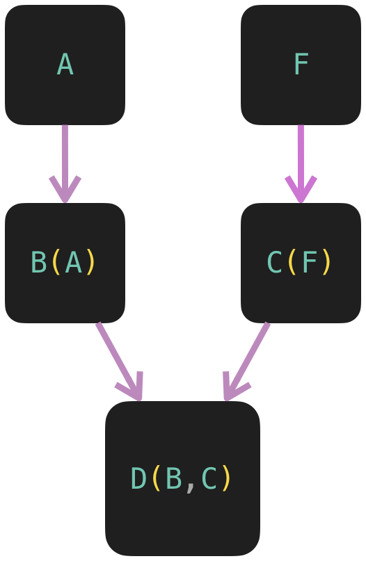

# ¿Que es el MRO?

MRO en python es Method Resolution Order. Es el orden en que Python busca en las clases base de un objeto para encontrar un método o atributo durante la ejecución.

En Python, el MRO define el orden en el que se buscan las clases base cuando se ejecuta un método. Primero, se busca el método o atributo dentro de una clase y luego sigue el orden que especificamos al heredar. Este orden también se llama Linearización de una clase y el conjunto de reglas se llama MRO.

Por ejemplo, si tienes una clase B que hereda de la clase A y creas un objeto de la clase B, cuando llamas a un método que está en ambas clases, Python primero buscará el método en la clase B. Si no lo encuentra allí, buscará en la clase A.

El MRO es especialmente útil en el caso de la herencia para buscar un método en las clases padre. En el caso de la herencia múltiple, los métodos se ejecutan en base al orden especificado al heredar las clases.

Para ver el MRO de una clase en Python, se puede usar el atributo `__mro__` o la función `mro()`.

```py
print(D.__mro__)
print(D.mro())
```

## Poniendo en practica 1

```py
class A:
    def hablar(self):
        print('Hola desde A')

class B(A):
    def hablar(self):
        print('Hola desde B')

class C(A):
    def hablar(self):
        print('Hola desde C')

class D(B,C):
    def hablar(self):
        print('Hola desde D')

d = D()

d.hablar()
```

El resultado que mostrara `d.hablar()` sera `Hola desde D`, ya que en la clase `D` se sobre escribe el método heredado.

### ¿Y si la clase `D` no tuviera el método `hablar()`?

```py
class A:
    def hablar(self):
        print('Hola desde A')

class B(A):
    def hablar(self):
        print('Hola desde B')

class C(A):
    def hablar(self):
        print('Hola desde C')

class D(B,C):
    pass

d = D()

d.hablar()
```

>El resultado que mostrara `d.hablar()` sera `Hola desde B`.

```py
class A:
    def hablar(self):
        print('Hola desde A')

class B(A):
    pass

class C(A):
    def hablar(self):
        print('Hola desde C')

class D(B,C):
    pass

d = D()

d.hablar()
```

>El resultado que mostrara `d.hablar()` sera `Hola desde C`.

```py
class A:
    def hablar(self):
        print('Hola desde A')

class B(A):
    pass

class C(A):
    pass

class D(B,C):
    pass

d = D()

d.hablar()
```

>El resultado que mostrara `d.hablar()` sera `Hola desde A`.

### Explicación

```py
class D(B,C):
    pass

d = D()

d.hablar()
```

La explicación es:

>[!NOTE]
> D > B > C > A

1. La clase `D`, hereda de `B` y `C`, por lo que primero busca el método en `B`, si este esta disponible lo ejecuta.

2. Si `B` no tiene el método, lo busca en `C` y si lo encuentra lo ejecuta.

3. Si `C` tampoco tiene el método, lo busca en la clase padre de `B` y `C` que es `A`



## Poniendo en practica 2

```py
class A:
    def hablar(self):
        print('Hola desde A')

class F:
    def hablar(self):
        print('Hola desde F')

class B(A):
    def hablar(self):
        print('Hola desde B')

class C(F):
    def hablar(self):
        print('Hola desde C')

class D(B,C):
    pass

d = D()

d.hablar()
```

>El resultado que mostrara `d.hablar()` sera `Hola desde B`

### Variando entre herencias

```py
class A:
    def hablar(self):
        print('Hola desde A')

class F:
    def hablar(self):
        print('Hola desde F')

class B(A):
    pass

class C(F):
    def hablar(self):
        print('Hola desde C')

class D(B,C):
    pass

d = D()

d.hablar()
```

>El resultado que mostrara `d.hablar()` sera `Hola desde A`.

#### ¿Pero porque?

Esto es porque MRO busca la rama completa. En la Practica 1, ambas clases (`B` y `C`) compartían el mismo padre `A`. Pero acá `B` viene de `A` y `C` viene de `F`.

>[!NOTE]
> D > B > A
>
> D > C > F

1. La clase `D`, hereda de `B` y `C`, por lo que primero busca el método en `B`, si este esta disponible lo ejecuta.

2. Si `B` no tiene el método, lo busca en `A` y si lo encuentra lo ejecuta.

3. Si `A` tampoco tiene el método, lo busca en `C`.

4. Si `C` tampoco tiene el método, lo termina de buscar en `F`


## Uso de `super()`

`super()` es una función que se utiliza para llamar a un método de una superclase. En Python, `super()` se usa comúnmente para llamar a métodos de una clase base dentro de una clase derivada.

¿Qué significa el uso de `super()`?
`super()` toma dos argumentos: la clase actual y un objeto que es una instancia de esa clase. Sin embargo, en la mayoría de los casos, se usa sin argumentos y Python determina automáticamente la clase y el objeto correcto para llamar al método de la superclase.

```py
class A:
    def hablar(self):
        print('Hola desde A')

class B(A):
    def hablar(self):
        super().hablar()
        print('Hola desde B')

b = B()
b.hablar()
```

El resultado será:

>Hola desde A
>
>Hola desde B
----
>[!NOTE]
>En el ejemplo, `super().hablar()` llama al método hablar de la clase A, antes de ejecutar el código adicional en la clase B.
